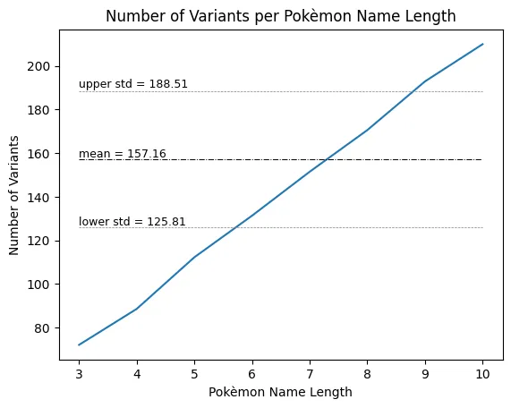

[back](README.md)
# Project description: Development of a typo generator in Python

 

 

## Introduction:
A typo generator is a useful tool for various use cases, including software development, data analysis, fraud detection, and language processing. This project focuses on creating a typo generator from scratch in Python and demonstrating how it can be used to generate and analyze different types of typos.

## Objective:
The main goal of this project is to develop a functional typo generator that is capable of generating different types of typos. The generator should work for single words, taking into account different types of errors such as keystroke errors, swap errors, capitalization errors, etc.

## Use cases:
Using a typo generator offers numerous use cases:

+ __Software development__: developers of word processing software and autocorrect functions can use the Typo Generator to test their products and ensure they are robust enough to handle different types of typos.

+ __Data analysis and machine learning__: In large text corpora, typo generators can be used to generate variations of words that are useful for recognizing patterns or training machine learning models.

+ __Spam and fraud detection__: Typo generators can help identify fraudulent emails or text messages by recognizing patterns of typos used by fraudsters to bypass spam filters or fraud detection systems.

+ __Speech recognition and processing__: Speech recognition and processing systems can be improved through the use of a typo generator by learning to deal with typos that occur when converting spoken language into text.

+ __Language teaching and testing__: Teachers can use typo generators to create exercises to help students improve their proofreading skills. They could also be used in exams to assess students' ability to recognize and correct typos.

## Visualization of the results:
The results were presented through various visualizations, including:
+ Distribution of variants per word to show how many different typos were generated for each word. 

 
+ Correlation analysis between the length of words and the number of variants generated to investigate whether longer words tend to have more variants. 

 
+ Graphs to illustrate the relationship between the number of variants and the length of words. 

 

## Findings:
Through this project I learned:
+ How to develop a typo generator in Python and implement different types of typos.
+ The importance of a typo generator in different use cases such as software development, data analysis and language processing.
+ The impact of word length on the number of typo variants generated and the need for bootstrapping to ensure a balanced distribution.
+ How to visualize and analyze the results of a typo generator to gain insight into the typos generated and understand their potential impact.

## Summary:
In this project, a typo generator was developed that was implemented in Python and can generate a variety of typos. By applying the generator in various use cases, its usefulness in software development, data analysis and language processing was demonstrated. This project provides a solid foundation for further research and application of typo generators in various fields.